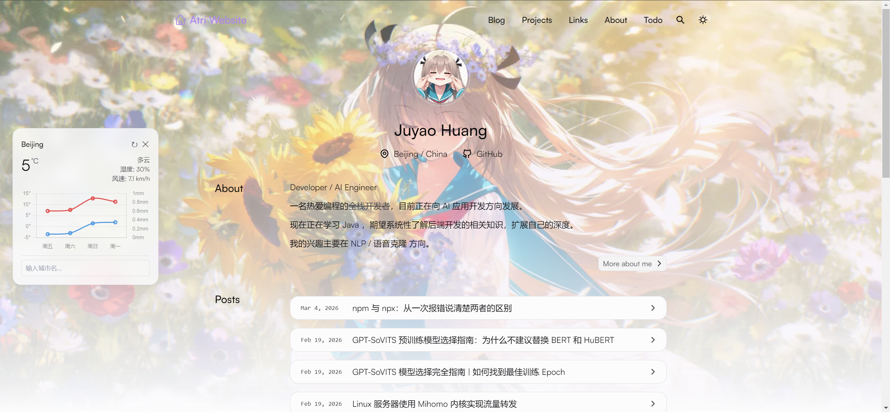
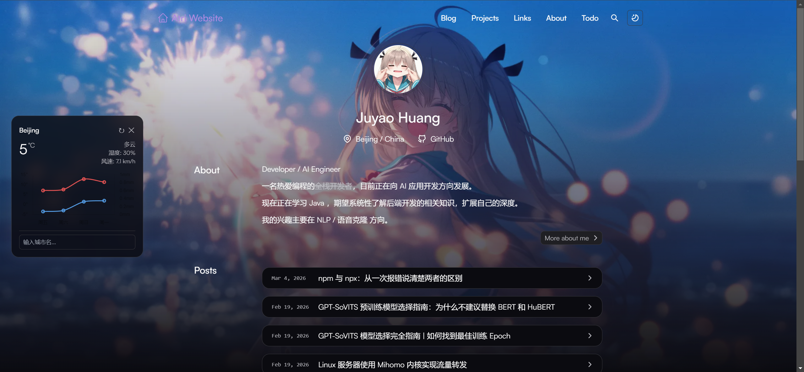

# LingLong

A personal blog site — clean, fast, and feature-rich.

[](https://www.juayohuang.top/)
[](https://astro.build/)
[](./LICENSE)

[中文文档](./README-zh-CN.md)

## Demo

| Light Mode | Dark Mode |
|:---:|:---:|
|  |  |

## Features

- **Blog** — Hierarchical categories (two levels), tags, archives, and pagination
- **Full-text search** — Powered by [Pagefind](https://pagefind.app/), no backend required
- **Comments** — [Waline](https://waline.js.org/) integration with pageview stats and emoji support
- **Math rendering** — LaTeX equations via [KaTeX](https://katex.org/)
- **Diagrams** — [Mermaid](https://mermaid.js.org/) with automatic dark/light theme switching
- **Code highlighting** — Shiki with GitHub light/dark themes; enhanced with copy button, collapse (15+ lines), title, language badge, diff and highlight notations
- **Image zoom** — Click-to-zoom powered by [medium-zoom](https://github.com/francoischalifour/medium-zoom)
- **Word count** — Post list cards show word count instead of estimated reading time
- **Weather widget** — Floating card on wide screens (>1400px); current conditions + 3-day forecast with [Chart.js](https://www.chartjs.org/) temperature/precipitation chart; auto-geolocation with [Nominatim](https://nominatim.org/) reverse geocoding; hourly detail panel; dark/light mode support
- **Todo calendar** — Password-protected todo management page backed by [Neon](https://neon.tech/) PostgreSQL; GitHub-style 52-week contribution heatmap, monthly calendar with due-date markers, slide-in CRUD panel
- **Private diary** — Password-protected diary system with blog-like rendering (list, detail, tags, archives); content stored in a [private git submodule](https://github.com/JuyaoHuang/diary-notes); interactive task checkboxes with Neon DB persistence; SSR-only (content never exposed as static HTML)
- **Diary-to-todo sync** — Automatically extracts checkbox items from diary `## today tasks` sections during build and inserts them into the todo calendar; idempotent with `ON CONFLICT DO NOTHING` dedup
- **Authentication** — HMAC-SHA256 signed tokens with 2-hour expiry; login rate limiting (5/min, 100/hour per IP); protects todo, diary, and related API routes
- **Avatar interaction** — Exponential spin animation on avatar hover
- **Friend links** — Links page with an activity logbook
- **Projects showcase** — Dedicated page for personal projects
- **Share buttons** — One-click sharing to Weibo, X, and Bluesky
- **Random quotes** — [Hitokoto](https://hitokoto.cn/) quotes displayed in the homepage footer
- **RSS feeds** — Available for both blog and docs
- **SEO** — Auto-generated sitemap, robots.txt, and social cards
- **Dark mode** — Follows system preference or manual toggle
- **Purple theme** — Custom purple color scheme migrated from the original project, with consistent hover effects across navigation, buttons, cards, article links, and TOC highlights
- **Homepage background** — Switchable between solid color gradient and custom background image (with separate light/dark mode images) via `site.config.ts`
- **Responsive** — Mobile and desktop friendly
- **Font optimization** — Satoshi font via Fontshare with automatic preloading
- **MDX support** — Use components inside Markdown

## Tech Stack

| Category | Technology |
|----------|------------|
| Framework | [Astro](https://astro.build/) 5.x |
| Styling | [UnoCSS](https://unocss.dev/) |
| Language | TypeScript |
| Deployment | [Vercel](https://vercel.com/) |
| Package Manager | [Bun](https://bun.sh/) |
| Theme Package | [astro-pure](https://www.npmjs.com/package/astro-pure) |
| Database | [Neon](https://neon.tech/) PostgreSQL (serverless, for todos + diary tasks) |
| Charts | [Chart.js](https://www.chartjs.org/) (weather widget) |

## Getting Started

### Prerequisites

- [Bun](https://bun.sh/) >= 1.0 (recommended) or Node.js >= 18
- Git

### Local Development

```bash
# Clone the repository
git clone https://github.com/JuyaoHuang/lingLong.git
cd lingLong

# Install dependencies
bun install

# Start the dev server
bun dev
```

Open `http://localhost:4321` in your browser to see the site.

### Build & Preview

```bash
# Type-check and build
bun build

# Preview the production build locally
bun preview
```

## Project Structure

```
.
├── public/                 # Static assets (favicon, images, etc.)
├── src/
│   ├── assets/             # Images, styles, tool icons
│   ├── components/
│   │   ├── todo/           # Todo calendar components (ContributionChart, MonthCalendar, TodoPanel, TodoItem)
│   │   ├── weather/        # Weather widget component
│   │   └── ...             # Other custom components
│   ├── content/
│   │   ├── blog/           # Blog posts (organized by category/subcategory)
│   │   ├── diary_notes/    # Private diary entries (git submodule → private repo)
│   │   └── docs/           # Documentation content
│   ├── layouts/            # Page layouts (BlogPost, DiaryPost, etc.)
│   ├── lib/                # Database helpers (Neon connection)
│   ├── integrations/       # Custom Astro integrations (diary-todo-sync)
│   ├── middleware.ts        # Auth middleware (protects /todo, /diary_notes, and related APIs)
│   ├── pages/              # Route pages
│   │   ├── api/            # REST API endpoints (auth + todo CRUD + diary tasks)
│   │   ├── blog/           # Blog list and post pages
│   │   ├── categories/     # Category pages (two-level hierarchy)
│   │   ├── diary_notes/    # Diary pages (SSR, auth required)
│   │   ├── tags/           # Tag pages
│   │   ├── archives/       # Archives page
│   │   ├── projects/       # Projects showcase
│   │   ├── links/          # Friend links
│   │   ├── search/         # Full-text search
│   │   ├── todo/           # Todo calendar page (auth required)
│   │   ├── about/          # About page
│   │   └── login.astro     # Login page (for todo access)
│   ├── plugins/            # Custom Shiki / rehype plugins
│   ├── utils/              # Utility functions
│   └── site.config.ts      # Site configuration
├── packages/pure/          # astro-pure local workspace (for development)
├── astro.config.ts         # Astro configuration
├── uno.config.ts           # UnoCSS configuration
└── package.json
```

## Configuration

All site settings are managed in `src/site.config.ts`:

```ts
export const theme: ThemeUserConfig = {
  title: 'Atri Website',
  author: 'Juyao Huang',
  description: '...',
  // Header menu, footer links, social accounts, etc.

  // Homepage background: 'gradient' (default) or 'image'
  homepageBackground: 'gradient',
}

export const integ: IntegrationUserConfig = {
  // Waline comments, Pagefind search, quotes, typography, etc.
}
```

For the full list of options, see the [astro-pure documentation](https://astro-pure.js.org/docs/setup/configuration).

## Commands

| Command | Description |
|---------|-------------|
| `bun dev` | Start the local development server |
| `bun build` | Type-check and build for production |
| `bun preview` | Preview the production build locally |
| `bun check` | Run TypeScript type checking only |
| `bun format` | Format code with Prettier |
| `bun lint` | Lint and auto-fix with ESLint |
| `bun pure new` | Create a new blog post via CLI wizard |
| `bun cache:avatars` | Cache friend link avatars to `public/avatars/` |

## Deployment

This project is deployed on [Vercel](https://vercel.com/) using the `@astrojs/vercel` adapter configured in `astro.config.ts`.

Push the repository to GitHub and import it in Vercel for automatic deployments. To deploy elsewhere, swap the adapter following the [Astro deployment guide](https://docs.astro.build/en/guides/deploy/).

## Acknowledgements

This project is built on top of [Astro Theme Pure](https://github.com/cworld1/astro-theme-pure) by [cworld1](https://github.com/cworld1). Many thanks for the excellent work.

## License

Licensed under the [Apache 2.0 License](./LICENSE).
