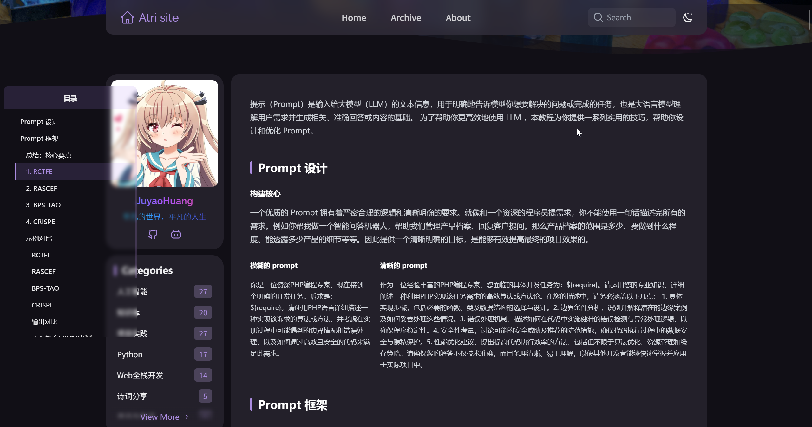

# lingLong 博客 - Astro 前端项目
[在线演示](https://juayohuang.top)

> **一个简洁优雅的 Astro 静态博客系统**。


------

<div align="right"> <a href="./README.md">English</a> | <a href="./README_zh.md"><strong>简体中文</strong></a> </div>

## 📋 项目简介

这是一个基于 Astro 5 构建的**现代化静态博客系统**，专为开发者和写作者设计，提供快速、优雅且高度可定制的博客平台。

## ✨ 核心特性

- ✅ **现代设计**：简洁优雅的用户界面，支持暗色模式
- ✅ **增强 Markdown**：支持 KaTeX 数学公式、代码高亮和自动生成目录
- ✅ **多级分类**：使用一级和二级分类组织文章
- ✅ **全文搜索**：基于 Pagefind 的快速客户端搜索
- ✅ **SEO 优化**：自动生成 Sitemap、RSS 订阅和元数据
- ✅ **国际化**：内置中英文支持
- ✅ **性能优先**：静态生成、图片懒加载、流畅动画
- ✅ **数据分析**：集成 Vercel Analytics 和 Speed Insights

------

## 🎨 截图展示

| 浅色模式 | 暗色模式 |
|:----------:|:---------:|
|  |  |
| 首页优雅设计 | 文章页与目录 |

------
## 🏗️ 技术栈

|    技术    | 版本 |         用途         |
| :--------------: | :-----: | :---------------------: |
|    **Astro**     |  5.3.0  |  静态站点生成器  |
|    **Svelte**    | 5.39.6  | 交互式组件  |
| **Tailwind CSS** | 3.4.17  |    样式框架    |
|   **Pagefind**   |  1.3.0  | 全文搜索引擎 |
|  **TypeScript**  |  5.9.2  |       类型安全       |

------

## 📦 项目结构

```
webTest/
├── src/
│   ├── components/        # UI 组件
│   ├── contents/posts/    # Markdown 文章
│   ├── layouts/           # 页面布局
│   ├── pages/             # 路由页面
│   ├── utils/             # 工具函数
│   └── styles/            # 样式文件
├── public/                # 静态资源
├── dist/                  # 构建输出
├── astro.config.mjs       # Astro 配置
├── linglong.config.ts     # 博客配置
├── tailwind.config.mjs    # Tailwind CSS 配置
└── package.json           # 依赖管理
```

------

## 🚀 快速开始

### 📋 前置要求

- **Node.js** >= 22.0
- **pnpm**（通过 Corepack 启用）

### 1️⃣ 开发

```bash
# 首次使用需启用 Corepack
corepack enable

# 安装依赖
pnpm install

# 启动开发服务器 (http://localhost:4321)
pnpm dev

# 构建生产版本
pnpm build

# 预览构建结果
pnpm preview
```

------

## 🌐 部署

### 方法 1：Vercel（推荐）

1. 将代码推送到 GitHub
2. 在 [Vercel](https://vercel.com) 导入你的仓库
3. Vercel 会自动检测 Astro 配置
4. 点击部署！

### 方法 2：Netlify

1. 将代码推送到 GitHub
2. 在 [Netlify](https://netlify.com) 导入你的仓库
3. 构建命令：`pnpm build`
4. 发布目录：`dist`

### 方法 3：静态托管

构建项目并将 `dist` 文件夹部署到任何静态托管服务：

```bash
pnpm build
# 上传 dist/ 文件夹到你的托管服务商
```

------

## 🎯 使用场景

### ✍️ 日常写作流程

1. 在 `src/contents/posts/` 目录下创建新的 Markdown 文件
2. 编写带有 frontmatter 的内容：
   ```markdown
   ---
   title: "你的文章标题"
   published: 2025-12-26
   description: "文章的简短描述"
   first_level_category: "技术"
   second_level_category: "Web 开发"
   tags: ["astro", "web", "博客"]
   draft: false
   ---

   # 你的文章标题

   你的内容...
   ```

### 📝 Frontmatter 字段说明

| 字段 | 必填 | 说明 | 示例 |
|:------|:---------|:------------|:--------|
| `title` | ✅ 是 | 文章标题 | `"Astro 入门指南"` |
| `published` | ✅ 是 | 发布日期 | `2025-12-26` |
| `description` | ✅ 是 | 用于 SEO 和文章卡片的简短描述 | `"一份全面的指南..."` |
| `first_level_category` | ✅ 是 | 一级分类 | `"技术"`、`"生活"` |
| `second_level_category` | ✅ 是 | 二级分类 | `"Web 开发"`、`"教程"` |
| `tags` | ❌ 否 | 文章标签（数组） | `["astro", "javascript"]` |
| `draft` | ❌ 否 | 设为 `true` 时在生产环境中隐藏 | `false`（默认） |

3. 运行 `pnpm dev` 本地预览，或运行 `pnpm build` 构建生产版本
4. 你的新文章会自动出现在首页和相应的分类页面

------

## 🐛 故障排除

### 前端构建失败

```bash
# 清除缓存并重新构建
rm -rf node_modules dist .astro
pnpm install
pnpm build
```

------

## 📚 相关资源

- [Astro 官方文档](https://docs.astro.build/)
- [Tailwind CSS 文档](https://tailwindcss.com/docs)
- [Pagefind 文档](https://pagefind.app/)

------

## 🙏 致谢

### 前端模板基于：

- [WhitePaper233 的 Yukina 模板](https://github.com/WhitePaper233/yukina)
- [Astro Fuwari 模板](https://github.com/saicaca/fuwari)
- [Hexo Shoka 主题](https://github.com/amehime/hexo-theme-shoka)

### 技术支持：

- Astro 团队
- Vercel 团队
- 开源社区

------

## 📄 许可证

MIT License - 详见 [LICENSE](LICENSE) 文件。

------

## 👨‍💻 贡献

欢迎提交 Issue 和 Pull Request！

1. Fork 本仓库
2. 创建你的特性分支 (`git checkout -b feature/AmazingFeature`)
3. 提交你的更改 (`git commit -m 'Add some AmazingFeature'`)
4. 推送到分支 (`git push origin feature/AmazingFeature`)
5. 打开一个 Pull Request

------

## 📧 联系方式

如有问题或建议，请通过以下方式联系我：

- 提交 [Issue](https://github.com/JuyaoHuang/lingLong/issues)
- 邮箱：[mail@juayohuang.top](mailto:mail@juayohuang.top)

------

**⭐ 如果这个项目对你有帮助，请给它一个 Star！**
