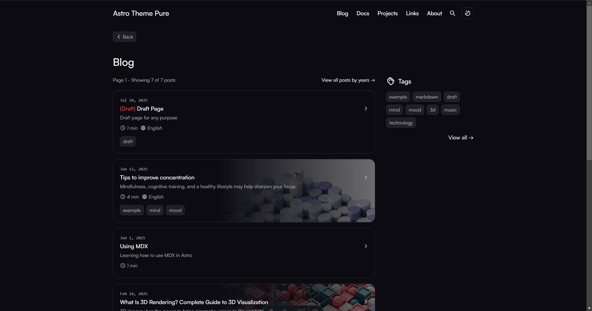

## Change 1: add extra words in fmt

当前项目在网站的博客文章路由处是完全扁平化展示。我希望它和原来的博客项目一样：存在一级分类、二级分类的层级目录分类。

原项目的 markdown fmt格式位于：D:\Coding\Wrote_Codes\webTest\src\content.config.ts。

原项目的文章URL结构：
```
pages
 ┣ categories
 ┃ ┣ [first_category]
 ┃ ┃ ┗ [second_category].astro
 ┃ ┣ index.astro
 ┃ ┗ [first_category].astro
 ┣ posts
 ┃ ┗ [...slug].astro
 ┣ tags
 ┃ ┣ index.astro
 ┃ ┗ [tag].astro
 ┣ about.astro
 ┣ archive.astro
 ┣ friends.astro
 ┣ robots.txt.ts
 ┣ rss.xml.ts
 ┗ [...page].astro
```
请注意D:\Coding\Wrote_Codes\webTest\src\pages\categories的URL结构。

**请参考原项目的分级categories的文章目录结构，对此项目的文章分类形式进行改写。**

**关键代码**：
- D:\Coding\Wrote_Codes\webTest\src\pages\[...page].astro
- D:\Coding\Wrote_Codes\webTest\src\pages\categories
- D:\Coding\Wrote_Codes\webTest\src\content.config.ts
- D:\Coding\Wrote_Codes\webTest\src\utils\content.ts

具体样式：


**呈现效果**：

在 URL:/blog页面的右侧、Tags组件的下方，显示 Categories 组件，可参考D:\Coding\Wrote_Codes\webTest\src\components\SideBar.astro中 categories 的实现。



**请注意**：先完成 fmt 字段的改写，再考虑 categories 的 CSS 样式。

**当前步骤**
✻ 创建分类工具函数文件… (esc to interrupt · ctrl+t to hide todos · 3m 33s · ↓ 706 tokens)
  ⎿  ☒ 修改 content.config.ts 添加分类字段
     ☐ 创建分类工具函数文件（类似 webTest 的 content.ts）
     ☐ 创建 categories 页面路由结构
     ☐ 在 /blog 页面添加 Categories 组件